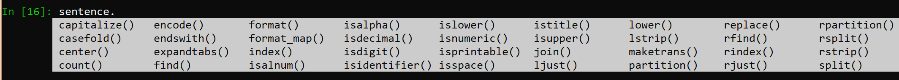

# Modulo 1
---

Este primer modulo es muy introductorio a Python y Anaconda; así como a las estructuras de datos básicas y sintaxis general. Solo anotaré algunas de las cosas que me parecieron importantes

## Librerias
---

**Libreria Math con varios de sus métodos**


**Setence y varios de sus métodos**


## Slicing 

```python
# Acceder a elementos especificos del string 
sentence = "Who would have thought that we were robots all along?"
sentence[:4]
sentence[-6:]
sentence[5:22]

# Validación
"robot" in sentence

# Cuenta de numeros 
sentence.count('w')

# Rmplazar elementos
sentence.replace("robot", "computer")

# Slicing con listas 
my_list = [10, 20, 30, 40, 50, 60]
my_list[:3] = "abc"
```